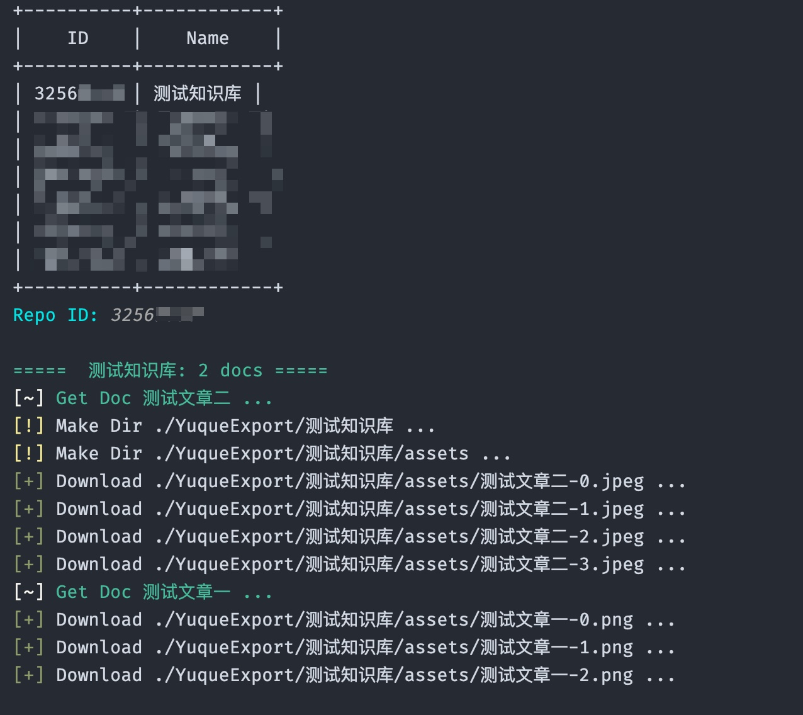

## 用法

- 安装相关依赖


```bash
$ pip3 install pyuque aiohttp huepy PrettyTable
```

- 然后在 [语雀-Token](https://www.yuque.com/settings/tokens) 页面申请一个有读取权限的密钥，填入`token`变量然后执行脚本即可

```
$ python3 YuqueExport.py
```




## 更新

- 2022-09-18
  - 新增：可一次性导出多个知识库，在输入知识库`ID`时用逗号`,`分隔即可
  - 新增：记录所下载的文档，并建立索引
  - 修复：将文档中不能作为文件名的字符进行编码
- 2022-09-17
  - 新增：对文档中的附件及其链接进行记录，因为附件需要鉴权，无法直接下载
